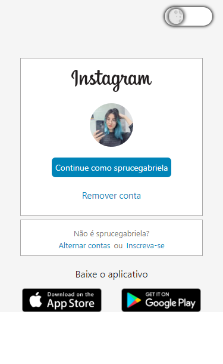

# Santander-Bootcamp 🌟✨

### Santander Bootcamp Fullstack Developer

#### Projeto Instagram 📷📱

Desafio de pojeto refente ao módulo II - HTML/CSS/JS

Reconstruir a interface do instagram responsiva

Adicinado o modo ecuro na pagina, utilizando o ReactJS com uma checkbox para fazer as alterações dos modos.

~~~javascript
    let [check, setCheck] = useState(false)

    const darkMode = () => {
        setCheck(!check)
    }
~~~

Um exemplo foi na parte do login do insta onde é alterada os valores das cores utilizando Sass

~~~javascript
    <Login
        chec={check == true ? White : Black}
        color={check == true ? Style.login1 : Style.login}
        alter={check == true ? Style.alter1 : Style.alter}/>
~~~

Aqui foi feito o comando para alterar a imagens e cores refentes ao logo e o estilo de cor a ser exibido.

    
    

Ministrado por Gabriela Pinheiro | Digital Innovation One Inc.